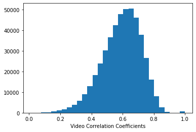

# ML 7641: Team 21

# Project Proposal
## Project Title: Multi-Modal Sarcasm Detection

### Introduction:
Sarcasm detection is a task under sentiment analysis that involves recognizing sarcastic utterances whose perlocutionary effect requires a great understanding of the conversational context, the utterance, and some basic knowledge to perceive the whole conversation. The ironic and metaphorical nature of sarcasm poses a challenge for computer models that try to analyze the sentiment of the conversation.

### Problem Definition:
Several NLP models have tried to detect sarcasm in text statements using context incongruity <a href="https://aclanthology.org/P15-2124.pdf">[1]</a> or Deep Learning NLP <a href="https://web.stanford.edu/class/archive/cs/cs224n/cs224n.1194/reports/custom/15791781.pdf">[2]</a>. Though these models have managed to achieve good accuracy by including context and embeddings of personality features <a href="https://arxiv.org/pdf/1610.08815.pdf">[3]</a>, the existing models do not focus on sarcasm detection in conversation. Past work in sarcasm detection using speech is based on identifying prosodal and spectral features that corresponds to sarcastic comments <a href="http://www1.cs.columbia.edu/~julia/papers/teppermanetal06.pdf">[4]</a>. Visual markers to understand sarcasm have been rarely studied. Thus, in our project, we aim to detect sarcasm in video segments of dialogues by extracting visual features, and combining it with the corresponding textual and audio cues to derive additional contextual information <a href="https://aclanthology.org/P14-2084">[5]</a> to identify sarcastic behavior. The motivation for sarcasm detection is to improve Conversational AI’s ability to perceive human interaction, Opinion mining, Marketing research, and Information categorization. 

### Dataset Description:
MUStARD(multimodal video corpus) <a href="https://arxiv.org/pdf/1906.01815.pdf">[6]</a> consists of audiovisual utterances annotated with sarcasm labels. Each utterance is accompanied by its context, which offers more details about the situation in which the utterance takes place. The dataset consists of 345 sarcastic videos and 6,020 non-sarcastic videos. The dataset is compiled from popular TV shows.

**Features of a Datapoint:**
- Video Sequence for Utterance
- Video Sequence for Context
- Transcripts of the Videos
- Speaker Name and Context character names
- Label (Sarcastic or not)

<!---
 
|:--:| 
| **Utterance and Context Video sequences: Text and Audio-visual components (Credit: <a href="https://arxiv.org/pdf/1906.01815.pdf">[6]</a>)** |

 
|:--:| 
| **Example of a JSON file that contains all information about the video sequences for a datapoint (Credit: <a href="https://arxiv.org/pdf/1906.01815.pdf">[6]</a>)** |
--->

<figcaption align="middle">Utterance and Context Video sequences: Text and Audio-visual components (Credit: <a href="https://arxiv.org/pdf/1906.01815.pdf">[6]</a>)</figcaption>

<figcaption align="middle">Example of a JSON file that contains all information about the video sequences for a datapoint (Credit: <a href="https://arxiv.org/pdf/1906.01815.pdf">[6]</a>)</figcaption>

### Methods:
A feature vector will be generated for each datapoint that will be a combination of its audio, video, and text.
- **Video**: CNNs like VGG, ImageNet, ResNet, etc. 
- **Audio**:  RNN models and Librosa library <a href="https://arxiv.org/pdf/1906.01815.pdf">[6]</a> (MFCC, melspectogram, spectral centroid). 
- **Text**: GloVE, ELMO, Word2Vec <a href="https://web.stanford.edu/class/archive/cs/cs224n/cs224n.1194/reports/custom/15791781.pdf">[1]</a>. 
 

The feature vectors of the 3 modalities will be combined and given as input to the supervised or unsupervised Machine Learning models. 

**Supervised methods:**
* Logistic Regression
* Naive Bayes
* Support Vector Machines
* Deep Neural Networks

**Metrics:** Precision, Recall, Accuracy, F1-Score

**Unsupervised Methods:**
* K-Mean Clustering
* Gaussian Mixture Model

**Metrics:** Silhouette Coefficient, Beta CV, pairwise measure and entropy based methods

<!---
 
|:--:| 
| **Feature Extraction and Data Analysis Flowchart** |
--->

<figcaption align="middle">Feature Extraction and Data Analysis Flowchart</figcaption>

### Potential Results and Discussion:
Our ideal goal would be to demonstrate how our multimodal approach outperforms unimodal approaches and identify the advantage of each module in providing context by experimenting with supervised and unsupervised methods. Evaluating the results of unsupervised clustering and use the observations for analyzing and cleaning the data is another task which will be addressed. Finally, will be looking to optimize and compare the different supervised classifiers using the evaluation metrics. The interpretability of the models will also be analyzed using AI Explainability tools.

### References:
<a href="https://aclanthology.org/P15-2124.pdf">[1]</a> Joshi, Aditya, Vinita Sharma, and Pushpak Bhattacharyya. "Harnessing context incongruity for sarcasm detection." Proceedings of the 53rd Annual Meeting of the Association for Computational Linguistics and the 7th International Joint Conference on Natural Language Processing (Volume 2: Short Papers). 2015.  
<a href="https://web.stanford.edu/class/archive/cs/cs224n/cs224n.1194/reports/custom/15791781.pdf">[2]</a> Lydia Xu, Vera Xu. "Project Report: Sarcasm Detection"  
<a href="https://arxiv.org/pdf/1610.08815.pdf">[3]</a> Poria, Soujanya, et al. "A deeper look into sarcastic tweets using deep convolutional neural networks." arXiv preprint arXiv:1610.08815 (2016).  
<a href="http://www1.cs.columbia.edu/~julia/papers/teppermanetal06.pdf">[4]</a> Tepperman, Joseph, David Traum, and Shrikanth Narayanan. "" Yeah right": sarcasm recognition for spoken dialogue systems." Ninth international conference on spoken language processing. 2006. 
<a href="https://aclanthology.org/P14-2084">[5]</a> Byron C. Wallace, Do Kook Choe, Laura Kertz, and Eugene Charniak. 2014. "Humans Require Context to Infer Ironic Intent (so Computers Probably do, too)". In Proceedings of the 52nd Annual Meeting of the Association for Computational Linguistics (Volume 2: Short Papers), pages 512–516, Baltimore, Maryland. Association for Computational Linguistics. 
<a href="https://arxiv.org/pdf/1906.01815.pdf">[6]</a> Castro, Santiago, et al. "Towards multimodal sarcasm detection (an _obviously_ perfect paper)." arXiv preprint arXiv:1906.01815 (2019).

### Team Member Contributions:

### Proposed Timeline:

### <a href="https://docs.google.com/spreadsheets/d/1IJ70LMrsxGJPikwkiIJkm8zs2LFqJ11leJsC7XJy1xw/edit?usp=sharing">Gantt Chart Link</a>
### <a href="https://www.canva.com/design/DAFOSFtGCEs/pXKpJgYamRmR7uMXbvFJcw/view?utm_content=DAFOSFtGCEs&utm_campaign=designshare&utm_medium=link&utm_source=viewer">Proposal Slides</a>
### <a href="https://www.youtube.com/watch?v=E7hygYxMoBk">Proposal Video - Youtube</a>

# Project MidTerm Report

## Feature Extraction
### Text
Feature extraction on Text is done using BERT. The labels are numerically encoded and then the dialogues are passed first through NLTK’s pretrained Punkt sentence tokenizer which produces a numerically encoded vector of tokens based on the tokeniser’s vocabulary, special tokens such as [CLS] and [SEP] are added, and it is suitably padded. The corresponding attention mask is generated and given as input along with the numerically encoded vector to  Pytorch pretrained BERT model that creates the vector embedding. This output is obtained from the final layer using output_all_encoded_layer=True to get the output of all the 12 layers resulting in a vector of size 768.

### Audio
Feature extraction on Audio is done using the Librosa library. First, we use the vocal separation technique implemented in [1] to extract the vocal component from the given audio file. This will ensure that any instruments or laugh tracks are removed. Then, we extract the Mel-frequency cepstral coefficients (MFCCs) and their delta, mel-scaled spectrogram and their delta and the spectral centroid of the extracted audio file. These components help in capturing audio features such as pitch, intonation, and other tonal-specific details of the speaker. We segment the audio into equal sized segments of size = 512, and we extract the above mentioned 283 features for each segment and compute the average across all segments. This serves as the feature representation of the audio file. 

### Video
The visual features are extracted for each frame in the utterance video using a pool5 layer of a ResNet-152 model that has been pre-trained on the ImageNet dataset. Each frame of the video is first resized, and their center is cropped and the image is normalized. The processed video frame is input to the ResNet-152 model and the features are extracted. We perform the same operation for all the frames in the given video and average the features across all the frames. The resuling 2048 feature vector is the feature representation of the video file. 

## Exploratory Data Analysis (EDA)
### EDA - Text

Audio and Video files can’t be analyzed directly without pre-processing. Therefore, we perform exploratory data analysis on the audio and video files after feature extraction. We also include the extracted text features in this process. 

**Handling Missing Values:** There are no missing values in the dataset. 

**Normalizing the dataset:** We use a min-max scaler to standardize the data so that all the values are between 0 and 1. 
We perform EDA on the scaled features. 

This EDA was an attempt to understand how the textual portion of the dataset is distributed between sarcastic and non-sarcastic labels and identify any inherent patterns that can be exploited by our model. We begin by plotting the distribution statistics of the dataset- the division of sarcastic dialogues uttered based on shows, actors etc.

We determine the polarity of sarcastic and non sarcastic dialogues to see if there is some consistency in each group which is sensible.

Then we also plot a wordcloud visualization after properly lemmatising and removing stop words to see what are some prominent words in each group to observe if these words are coherent and likely to make a sentence sound sarcastic. 

After performing this text analysis, we have a strong idea that the data is coherent, sensible and well distributed.

Audio and Video files can’t be analyzed directly without pre-processing. Therefore, we perform exploratory data analysis on the audio and video files after feature extraction. We also include the extracted text features in this process. 

There are no missing values in the dataset. We use a min-max scaler to standardize the data so that all the values are between 0 and 1. We perform EDA on the scaled features.

### Correlation - Text, Audio, Video
Analyzing the correlation matrix of the text features we can observe that most features have a positive correlation with values > 0.7. For the audio features most features have a complete overlap with all values being > 0.975. For the video features some features have a correlation value < 0.4 but a good proportion of features have a correlation value > 0.4. In summary, as the features are highly correlated, they can be reduced to create a smaller set of features that can still capture the variance in the data. 

### Mean Difference - Text, Audio, Video
To compare how the feature values change between the “sarcasm” class and “not sarcasm” class, we analyze the feature value distribution for each class using a 1D histogram. More specifically, we analyze how much the mean of the features changes between the “sarcasm” and “not sarcasm” classes:

mean_difference = abs(mean(X[feature_number, y_sarcastic]) - mean(X[feature_number, y_not_sarcastic])) 

The higher the value of mean_difference the greater is the shift in the feature distribution across classes. The following histograms represent the mean_difference for the text, audio and the video modality.

  

From the graphs we can observe that most of the features have a mean_difference < 0.05, there are only 4 features with mean_difference > 0.1, and 73 features for mean_difference > 0.05 and mean_difference < 0.1. So, there is no significant difference between the feature distribution across classes. 

## Feature Reduction/Selection

For feature reduction/selection techniques we use the following techniques:

### Most Drifted Features
We sort the mean_difference of all the features in a non-increasing order. We call this order the “most drifted features”. Then, we use 5-fold cross validation technique to determine the best top-k most drifted features that maximizes the f1-score on the test data.

### PCA

Using the Principle Component analysis technique to extract the top-100 principle components. From PCA we can observe that only one component contributes for more than 5% of explained variance and 8 features that capture more than 2% of the variance. Therefore, we can conclude that although features might be correlated there aren’t any particular components that capture most of the variance in the data. Also, the cumulative variance captured by the first 100 features = 77.134%. 

## Model Used
### Supervised
#### Support Vector Machine

For the supervised models we use a Support Vector Machine for the binary classification problem. As the number of features in our dataset is high compared to the number of data points, we use SVMs which are capable of handling high dimensional feature space. We run 10-fold cross validation to determine the best feature reduction/selection technique. 

*Note that here we don’t perform hyper parameter tuning for the SVM classifier. This will be explored later. 

#### Gaussian Naive Bayes

Along with SVM, we also use Gaussian NB to compare our results. GNB is a relatively simple model compared to SVM and can be trained quickly.

Performance of SVM remains relatively constant compared to GNB as we increase the number of features. Also, the performance of SVM remains better than GNB. Moreover, compared to top-k drifted features, PCA performs poorly across both GNB and SVM, in all metrics. Therefore, we can conclude that the most drifted feature selection performs better than PCA.  

## Results and Discussion

| Features             	| Selection/Reduction  	| Model 	| Precision      	| Recall          	| Accuracy       	| F1-Score       	| ROC-AUC        	|
|----------------------	|----------------------	|-------	|----------------	|-----------------	|----------------	|----------------	|----------------	|
| Text                 	| MD                   	| GNB   	| 0.632 +- 0.077 	| 0.744 +- 0.0543 	| 0656 +- 0.052  	| 0.681 +- 0.059 	| 0.704 +- 0.065 	|
|                      	|                      	| SVM   	| 0.624 +- 0.090 	| 0.721 +- 0.073  	| 0.642 +- 0.053 	| 0.665 +- 0.063 	| 0.609 +- 0.012 	|
|                      	| PCA                  	| GNB   	| 0.583 +- 0.104 	| 0.595 +- 0.078  	| 0.581 +- 0.066 	| 0.584 +- 0.076 	| 0.621 +- 0.055 	|
|                      	|                      	| SVM   	| 0.620 +- 0.089 	| 0.657 +- 0.085  	| 0.624 +- 0.060 	| 0.633 +- 0.067 	| 0.701 +- 0.058 	|
| Audio                	| MD                   	| GNB   	| 0.793 +- 0.146 	| 0.176 +- 0.043  	| 0.562 +- 0.047 	| 0.284 +- 0.056 	| 0.588 +- 0.023 	|
|                      	|                      	| SVM   	| 0.646 +- 0.086 	| 0.646 +- 0.043  	| 0.642 +- 0.044 	| 0.642 +- 0.044 	| 0.709 +- 0.052 	|
|                      	| PCA                  	| GNB   	| 0.659 +- 0.196 	| 0.166 +- 0.057  	| 0.537 +- 0.053 	| 0.259 +- 0.077 	| 0.522 +- 0.054 	|
|                      	|                      	| SVM   	| 0.663 +- 0.065 	| 0.715 +- 0.037  	| 0.673 +- 0.033 	| 0.685 +- 0.034 	| 0.740 +- 0.035 	|
| Video                	| MD                   	| GNB   	| 0.665 +- 0.083 	| 0.743 +- 0.085  	| 0.684 +- 0.070 	| 0.699 +- 0.072 	| 0.761 +- 0.060 	|
|                      	|                      	| SVM   	| 0.688 +- 0.056 	| 0.691 +- 0.064  	| 0.691 +- 0.039 	| 0.690 +- 0.049 	| 0.747 +- 0.057 	|
|                      	| PCA                  	| GNB   	| 0.607 +- 0.084 	| 0.637 +- 0.077  	| 0.613 +- 0.055 	| 0.619 +- 0.070 	| 0.665 +- 0.064 	|
|                      	|                      	| SVM   	| 0.672 +- 0.077 	| 0.602 +- 0.096  	| 0.654 +- 0.054 	| 0.630 +- 0.729 	| 0.724 +- 0.052 	|
| Text + Audio + Video 	| MD                   	| GNB   	| 0.695 +- 0.094 	| 0.783 +- 0.074  	| 0.719 +- 0.071 	| 0.734 +- 0.075 	| 0.780 +- 0.063 	|
|                      	|                      	| SVM   	| 0.725 +- 0.064 	| 0.763 +- 0.076  	| 0.738 +- 0.048 	| 0.741 +- 0.059 	| 0.802 +- 0.041 	|
|                      	| PCA                  	| GNB   	| 0.655 +- 0.102 	| 0.652 +- 0.086  	| 0.655 +- 0.069 	| 0.650 +- 0.084 	| 0.715 +- 0.079 	|
|                      	|                      	| SVM   	| 0.688 +- 0.097 	| 0.684 +- 0.076  	| 0.686 +- 0.070 	| 0.683 +- 0.076 	| 0.767 +- 0.064 	|

So we can see that when we combine all three modalities the performance is highly improved compared to individual modalities which indicates that it is useful to follow a multimodal approach. 

While comparing individual modality performance, video is superior, followed by audio and then text. Upon investigation, it was understood that the visual model provides more contextual cues than the textual or audio model when it comes to utterances.  Audio along with its features on pitch and power of the vocal tract provides more information than text. Text provides the least contextual clues for the classifier to detect sarcasm accurately.
Overall, the performance of the Support vector machine classifier is better than that of Gaussian Naive Bayes. The performance is superior when we select the Most Drifted features than when we select features using PCA.

## Future Directions

Hyper parameter tuning for supervised models
Unsupervised model implementations (GMM, KMeans)
Explore other feature extraction techniques
Evaluating the performance on external dataset
