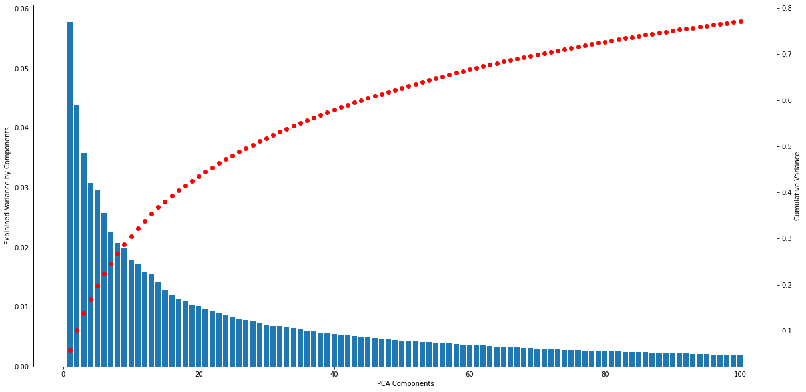
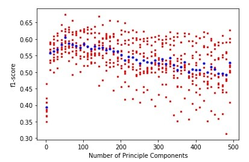
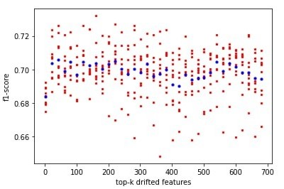
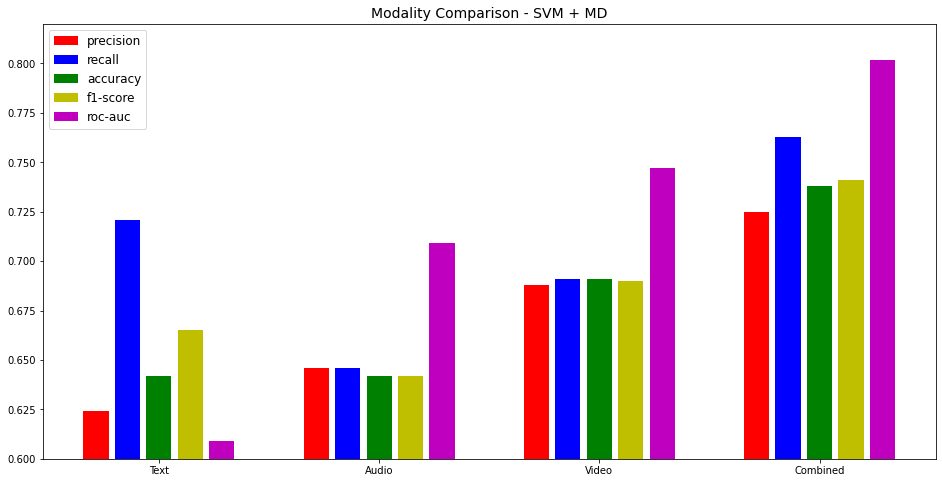

# ML 7641: Team 21

# Project Midterm Report
## Project Title: Multi-Modal Sarcasm Detection

### Introduction:
Sarcasm detection is a task under sentiment analysis that involves recognizing sarcastic utterances whose perlocutionary effect requires a great understanding of the conversational context, the utterance, and some basic knowledge to perceive the whole conversation. The ironic and metaphorical nature of sarcasm poses a challenge for computer models that try to analyze the sentiment of the conversation.

### Problem Definition:
Several NLP models have tried to detect sarcasm in text statements using context incongruity <a href="https://aclanthology.org/P15-2124.pdf">[1]</a> or Deep Learning NLP <a href="https://web.stanford.edu/class/archive/cs/cs224n/cs224n.1194/reports/custom/15791781.pdf">[2]</a>. Though these models have managed to achieve good accuracy by including context and embeddings of personality features <a href="https://arxiv.org/pdf/1610.08815.pdf">[3]</a>, the existing models do not focus on sarcasm detection in conversation. Past work in sarcasm detection using speech is based on identifying prosodal and spectral features that corresponds to sarcastic comments <a href="http://www1.cs.columbia.edu/~julia/papers/teppermanetal06.pdf">[4]</a>. Visual markers to understand sarcasm have been rarely studied. Thus, in our project, we aim to detect sarcasm in video segments of dialogues by extracting visual features, and combining it with the corresponding textual and audio cues to derive additional contextual information <a href="https://aclanthology.org/P14-2084">[5]</a> to identify sarcastic behavior. The motivation for sarcasm detection is to improve Conversational AI’s ability to perceive human interaction, Opinion mining, Marketing research, and Information categorization. 

### Dataset Description:
MUStARD(multimodal video corpus) <a href="https://arxiv.org/pdf/1906.01815.pdf">[6]</a> consists of audiovisual utterances annotated with sarcasm labels. Each utterance is accompanied by its context, which offers more details about the situation in which the utterance takes place. The dataset consists of 345 sarcastic videos and 6,020 non-sarcastic videos. The dataset is compiled from popular TV shows.

**Features of a Datapoint:**
- Video Sequence for Utterance
- Video Sequence for Context
- Transcripts of the Videos
- Speaker Name and Context character names
- Label (Sarcastic or not)

<!---
 
|:--:| 
| **Utterance and Context Video sequences: Text and Audio-visual components (Credit: <a href="https://arxiv.org/pdf/1906.01815.pdf">[6]</a>)** |

 
|:--:| 
| **Example of a JSON file that contains all information about the video sequences for a datapoint (Credit: <a href="https://arxiv.org/pdf/1906.01815.pdf">[6]</a>)** |
--->

<figcaption align="middle">Utterance and Context Video sequences: Text and Audio-visual components (Credit: <a href="https://arxiv.org/pdf/1906.01815.pdf">[6]</a>)</figcaption>

<figcaption align="middle">Example of a JSON file that contains all information about the video sequences for a datapoint (Credit: <a href="https://arxiv.org/pdf/1906.01815.pdf">[6]</a>)</figcaption>

### Methods:
A feature vector will be generated for each datapoint that will be a combination of its audio, video, and text.
- **Video**: CNNs like VGG, ImageNet, ResNet, etc. 
- **Audio**:  RNN models and Librosa library <a href="https://arxiv.org/pdf/1906.01815.pdf">[6]</a> (MFCC, melspectogram, spectral centroid). 
- **Text**: BERT, GloVE, ELMO, Word2Vec <a href="https://web.stanford.edu/class/archive/cs/cs224n/cs224n.1194/reports/custom/15791781.pdf">[1]</a>. 
 

The feature vectors of the 3 modalities will be combined and given as input to the supervised or unsupervised Machine Learning models. 

**Supervised methods:**
* Naive Bayes
* Support Vector Machines
* Logistic Regression
* Deep Neural Networks

**Metrics:** Precision, Recall, Accuracy, F1-Score

**Unsupervised Methods:**
* Gaussian Mixture Model

**Metrics:** Silhouette Coefficient, Beta CV, pairwise measure and entropy based methods

<!---
 
|:--:| 
| **Feature Extraction and Data Analysis Flowchart** |
--->

<figcaption align="middle">Feature Extraction and Data Analysis Flowchart</figcaption>

## Feature Extraction
### Text
Feature extraction on Text is done using BERT. The dialogues are tokenized into sentences and then into words using NLTK's PUNKT library. The corresponding attention mask is generated and given as input along with the numerically encoded vector to Pytorch pretrained BERT model to create the vector embedding. This output is obtained from the final layer using output_all_encoded_layer=True to get the output of all the 12 layers resulting in a vector of size 768.

### Audio
Feature extraction on Audio is done using the Librosa library. First, we use the vocal separation technique implemented in <a href="https://librosa.org/librosa_gallery/auto_examples/plot_vocal_separation.html">[7]</a> to extract the vocal component from the given audio file. This will ensure that any instruments or laugh tracks are removed. Then, we extract the Mel-frequency cepstral coefficients (MFCCs) and their delta, mel-scaled spectrogram and their delta and the spectral centroid of the extracted audio file. These components help in capturing audio features such as pitch, intonation, and other tonal-specific details of the speaker. We segment the audio into equal sized segments of size = 512, and we extract the above mentioned 283 features for each segment and compute the average across all segments. This serves as the feature representation of the audio file. 

<figcaption align="middle">Vocal Separation Plot using Librosa</figcaption>

From the above figure we can observe that Full Spectrum (actual audio file) = Foreground (Vocals of Characters) + Background (Laugh Tracks and Instruments). By using the vocal separation technique in <a href="https://librosa.org/librosa_gallery/auto_examples/plot_vocal_separation.html">[7]</a>, we remove the background information and extract only the foreground information. This ensures that there isn't any inherent biases such as laugh tracks in the audio feature representation. 

### Video
The visual features are extracted for each frame in the utterance video using a pool5 layer of a ResNet-152 model that has been pre-trained on the ImageNet dataset. Each frame of the video is first resized, and their center is cropped and then the image is normalized. The processed video frame is input to the ResNet-152 model and the features are extracted. We perform the same operation for all the frames in the given video and average the features across all the frames. The resuling 2048 feature vector is the feature representation of the video file. 

## Exploratory Data Analysis (EDA)
### Data preprocessing

**Handling Missing Values:** There are no missing values in the dataset. 

**Normalizing the dataset:** We use a min-max scaler to standardize the data so that all the values are between 0 and 1. 
We perform EDA on the scaled features. 

Audio and Video files can’t be analyzed directly without pre-processing. Therefore, we perform exploratory data analysis on the audio and video files after feature extraction. We also include the extracted text features in this process. 

### Text EDA

This EDA was an attempt to understand how the textual portion of the dataset is distributed between sarcastic and non-sarcastic labels and identify any inherent patterns that can be exploited by our model. We begin by plotting the distribution statistics of the dataset- the division of sarcastic dialogues uttered based on shows, actors etc.

  

  <figcaption>Character and TV Show Distribution</figcaption>
  

We determine the polarity of sarcastic and non sarcastic dialogues to see if there is some consistency in each group which is sensible. Through analyzing these results we can understand that sarcastic statements are overly positive, to convey the opposite statement, as in when we are generally annoyed about something we sound sarcastically at peace with it. Non sarcastic dialogues, on the other hand, are mostly neutral, which seems like a fair distribution. 

Then we also plot a wordcloud visualization after properly lemmatising and removing stop words to see what are some prominent words in each group to observe if these words are coherent and likely to make a sentence sound sarcastic. We didn't gain a lot of relevant or useful information through wordcloud. This could depict the diversity in data.

<figcaption align="middle">Word cloud for sarcastic and non-sarcastic words</figcaption>

After performing this text analysis, we have a strong idea that the data is coherent, sensible and well distributed.

### Correlation - Text, Audio, Video
Analyzing the correlation matrix of the text features we can observe that most features have a positive correlation with values > 0.7. For the audio features most features have a complete overlap with all values being > 0.975. For the video features some features have a correlation value < 0.4 but a good proportion of features have a correlation value > 0.4. In summary, as the features are highly correlated, they can be reduced to create a smaller set of features that can still capture the variance in the data. 

### Mean Difference - Text, Audio, Video
To compare how the feature values change between the “sarcasm” class and “not sarcasm” class, we analyze the feature value distribution for each class using a 1D histogram. More specifically, we analyze how much the mean of the features changes between the “sarcasm” and “not sarcasm” classes:

mean difference = abs(mean(X[feature_number, y_sarcastic]) - mean(X[feature_number, y_not_sarcastic]))

The higher the value of mean_difference the greater is the shift in the feature distribution across classes. The following histograms represent the mean_difference for the text, audio and the video modality.

  

From the graphs we can observe that most of the features have a mean_difference < 0.05, there are only 4 features with mean_difference > 0.1, and 73 features for mean_difference > 0.05 and mean_difference < 0.1. So, there is no significant difference between the feature distribution across classes. 

## Feature Reduction/Selection

For feature reduction/selection techniques we use the following techniques:

### Most Drifted Features
We sort the mean_difference of all the features in a non-increasing order. We call this order the “most drifted features”. Then, we use 10-fold cross validation technique to determine the best top-k most drifted features that maximizes the f1-score on the test data.

### Principal Component Analysis - PCA

Using the Principal Component analysis technique to extract the top-100 principal components. From PCA we can observe that only one component contributes for more than 5% of explained variance and 8 features that capture more than 2% of the variance. Therefore, we can conclude that although features might be correlated there aren’t any particular components that capture most of the variance in the data. Also, the cumulative variance captured by the first 100 features = 77.134%. 

<figcaption align="middle">Explained variance by PCA components</figcaption>

## Supervised Learning Methods
### Support Vector Machine

For the supervised models we use a Support Vector Machine for the binary classification problem. As the number of features in our dataset is high compared to the number of data points, we use SVMs which are capable of handling high dimensional feature space. We use the "rbf" kernel in our SVM implementation. We run 10-fold cross validation to determine the best feature reduction/selection technique. We observe that the performance of SVM remains almost constant even with the increase in the number of features (after the initial increase). **Even when we use all the 2000 features the performance of the model only reduces by around 2% from the highest performance.** Especially in PCA, after the initial improvement in performance the performance completely saturates. This clearly shows the ability of SVMs to handle high dimensional data efficiently. 

Note: Red denotes the actual values. Blue denotes the mean values [Applies to all plots]

### Gaussian Naive Bayes

Along with SVM, we also use Gaussian NB to compare our results. GNB is a relatively simple model compared to SVM and can be trained quickly. In contrast to SVMs, the performance of GNB reduces with the increase in features as they can't handle high dimensional data. The drop in performance in observed across both the feature selection/reduction techniques. Also, the performance of GNB remains poorer compared the SVMs. **Moreover, compared to top-k drifted features, PCA performs poorly across both GNB and SVM, in all metrics. **  

### Random Forests

Random Forests models usually can handle more complex relations and therefore achieve better performances. However, due to the small size of our data set and high dimensional features, the random forests model overfits on the dataset despite parameter tuning and hence its performance on the test set is poor. Suprisingly, the performance is worse than both SVM and GNB. We believe that by collecting more data, the performance of the RF models can be improved as we can avoid overfitting. Moreover, the most drifted feature selection technique still outperforms PCA across all metrics despite the poor performance. 

### XGBoost

The XG Boost classifier is a modified random classifier model. XGBoost straight away prunes the tree with a score called “Similarity score” before entering into the actual modeling purposes. It considers the difference between the similarity score of the node and the similarity score of the children. If the gain from a node is found to be minimal then it just stops constructing the tree to a greater depth which can overcome the challenge of overfitting to a great extend. Meanwhile, the Random forest might probably overfit the data if the majority of the trees in the forest are provided with similar samples. Hence, the XG boost model performs better than random forest. We can also conclude here that the most drifted feature selection performs better than PCA.

### Deep Neural Networks

For Deep Learning methods, we use a Neural Network for this binary classification problem. First we developed a model for the individual modalities and then a separate model for the three modalities (audio, video, text) together. The model architectures are shown below.

<figcaption align="middle">Audio Processing Model Architecture</figcaption>

<figcaption align="middle">Video Processing Model Architecture</figcaption>

<figcaption align="middle">Text Processing Model Architecture</figcaption>
  
  <figcaption align="middle">Combined Model Architecture</figcaption>

                                         
The models were trained using Adam Optimizer and the loss function Binary Cross Entropy. 
Though the Neural Network can understand complex patterns, because of the lesser number of datapoints it was overfitting the dataset. Hence we simplified the model architecture and used techniques like regularization techniques to improve the performance. Even then, the model's performance was poorer than SVMs.                            

<figcaption align="middle">Audio and Video Model Training</figcaption>

<figcaption align="middle">Text and Combined-Modalities Model Training</figcaption>

## Unsupervised/Semisupervised Learning

### Gaussian Mixture Models

For the unsupervised learning models, we use the Gausian Mixture Model with number of components as 2 (binary classification), "full" covariance matrix and using "kmeans" to initialize the parameters of the model. We observe that performance of the GMM model increases initially with increase in the number of features while using the most drifted feature selection technique, but the performance drops and saturates with high number of features. In contrast, while using PCA, the model's performance does not increase. We conlcude that GMM models perform poorly when the number of features are very high but can perform well for lesser number of features. 

### K Means Clustering

Along with GMM, we also analyze the performance of the K Means Clustering algorithm. Similar to GMM, we set the number of clusters to 2 because of the binary classification task, and use "kmeans++" to initialize the cluster centroids. Comapred to GMM, K Means is able to achieve better performance with the most drifted feature selection algorithm. However, while using PCA, the performance remains similar to GMM. Hence, we can conlude that PCA does not work well for this problem. Although the PCA components capture the most variance in the data, the data labels (or classes) are not acccounted for in that process. However, the most drifted features account for the drifts in feature based on the class labels. 

**Note:** As we use class labels for finding the most drifted features, the GMM/KMeans with most drifted feature is semi-supervised and not unsupervised. However, using PCA with GMM/KMeans is unsupervised. 

## Results and Discussion

### Modality Comparison

In the above figure, we compare the performance of the SVM using the MD feature selection technique on individual modalities namely: text, audio, video and the combined modality (Text + Audio + Video). While comparing individual modality performance, video is superior, followed by audio and then text. Upon investigation, it was understood that the visual model provides more contextual cues than the textual or audio model when it comes to utterances.  Audio along with its features on pitch and power of the vocal tract provides more information than text. Text provides the least contextual clues for the classifier to detect sarcasm accurately. We can observe the behaviour from the above figure, where the combined modalities clearly outperform the individual modalities across all the metric. **Therefore, having multiple modalities can help extract more meaningful features that can in turn help capture the relations and hence achieve superior performance.**

### Feature Selection/Reduction Comparison

In the above figure, we compare the performance metrics (accuracy, f1-score, and roc-auc) across all the supervised learning models for the two feature reduction techniques analyzed in this project. We observe that the most drifted feature selectino technique outperforms PCA across all the models. As the most drifted feature selection algorithm computes the drift using the class labels, it is able to choose feature more relevant to the given task. However, as PCA focuses on maximizing the variance captured and does not account for the class labels, it does not choose the most task-relevant features. Hence, for this task MD performs better than PCA. 

### Supervised Learning

| Features 	| Selection/Reduction  	| Model 	| Precision 	| Recall 	| Accuracy 	| F1-Score 	| ROC-AUC 	|
|---	|---	|---	|---	|---	|---	|---	|---	|
| Text 	| MD 	| GNB 	| 0.632+-0.077 	| 0.744+-0.0543 	| 0656+-0.052 	| 0.681+-0.059 	| 0.704+-0.065 	|
|  	| MD 	| SVM 	| 0.624+-0.090 	| 0.721+-0.073 	| 0.642+-0.053 	| 0.665+-0.063 	| 0.609+-0.012 	|
|  	| MD 	| RF 	| 0.618+-0.094 	| 0.628+-0.060 	| 0.618+-0.065 	| 0.621+- 0.070 	| 0.701+-0.071 	|
|  	| MD 	| XGB 	| 0.624+-0.097 	| 0.657+-0.065 	| 0.626+-0.072 	| 0.636+-0.069 	| 0.691+-0.071 	|
|  	| PCA 	| GNB 	| 0.583+-0.104 	| 0.595+-0.078 	| 0.581+-0.066 	| 0.584+-0.076 	| 0.621+-0.055 	|
|  	| PCA 	| SVM 	| 0.620+-0.089 	| 0.657+-0.085 	| 0.624+-0.060 	| 0.633+-0.067 	| 0.701+-0.058 	|
|  	| None 	| MLP 	| 0.58+-0.10 	| 0.53+-0.005 	| 0.550+-0.007 	| 0.55+-0.053 	| 0.523+-0.104 	|
| Audio 	| MD 	| GNB 	| **0.793+-0.146** 	| 0.176+-0.043 	| 0.562+-0.047 	| 0.284+-0.056 	| 0.588+-0.023 	|
|  	| MD 	| SVM 	| 0.646+-0.086 	| 0.646+-0.043 	| 0.642+-0.044 	| 0.642+-0.044 	| 0.709+-0.052 	|
|  	| MD 	| RF 	| 0.642+-0.087 	| 0.678+-0.043 	| 0.647+-0.048 	| 0.656+-0.054 	| 0.700+-0.00432 	|
|  	| MD 	| XGB 	| 0.652+-0.077 	| 0.695+-0.067 	| 0.659+-0.040 	| 0.668+-0.047 	| 0.703+-0.034 	|
|  	| PCA 	| GNB 	| 0.659+-0.196 	| 0.166+-0.057 	| 0.537+-0.053 	| 0.259+-0.077 	| 0.522+-0.054 	|
|  	| PCA 	| SVM 	| 0.663+-0.065 	| 0.715+-0.037 	| 0.673+-0.033 	| 0.685+-0.034 	| 0.740+-0.035 	|
|  	| None 	| MLP 	| 0.70+-0.074 	| 0.64+-0.001 	| 0.6232+-0.196 	| 0.667+-0.077 	| 0.667+-0.032 	|
| Video 	| MD 	| GNB 	| 0.665+-0.083 	| 0.743+-0.085 	| 0.684+-0.070 	| 0.699+-0.072 	| 0.761+-0.060 	|
|  	| MD 	| SVM 	| 0.688+-0.056 	| 0.691+-0.064 	| 0.691+-0.039 	| 0.690+-0.049 	| 0.747+-0.057 	|
|  	| MD 	| RF 	| 0.676+-0.060 	| 0.671+-0.0795 	| 0.675+-0.043 	| 0.671+-0.054 	| 0.746+-0.066 	|
|  	| MD 	| XGB 	| 0.678+-0.074 	| 0.676+-0.075 	| 0.678+-0.050 	| 0.674+-0.060 	| 0.754+-0.063 	|
|  	| PCA 	| GNB 	| 0.607+-0.084 	| 0.637+-0.077 	| 0.613+-0.055 	| 0.619+-0.070 	| 0.665+-0.064 	|
|  	| PCA 	| SVM 	| 0.672+-0.077 	| 0.602+-0.096 	| 0.654+-0.054 	| 0.630+-0.729 	| 0.724+-0.052 	|
|  	| None 	| MLP 	| 0.71+-0.194 	| 0.46+-0.071 	| 0.6087+-0.082 	| 0.56+-0.056 	| 0.6203 +-0.010 	|
| Text + Audio + Video 	| MD 	| GNB 	| 0.695+-0.094 	| **0.783+-0.074** 	| 0.719+-0.071 	| 0.734+-0.075 	| 0.780+-0.063 	|
|  	| MD 	| SVM 	| **0.725+-0.064** 	| 0.763+-0.076 	| **0.738+-0.048** 	| **0.741+-0.059** 	| **0.802+-0.041** 	|
|  	| MD 	| RF 	| 0.676+-0.078 	| 0.710+-0.104 	| 0.688+-0.064 	| 0.69+-0.081 	| 0.785+-0.057 	|
|  	| MD 	| XGB 	| 0.703+-0.077 	| 0.694+-0.081 	| 0.701+-0.0601 	| 0.697+-0.0711 	| 0.7699+-0.058 	|
|  	| PCA 	| GNB 	| 0.655+-0.102 	| 0.652+-0.086 	| 0.655+-0.069 	| 0.650+-0.084 	| 0.715+-0.079 	|
|  	| PCA 	| SVM 	| 0.688+-0.097 	| 0.684+-0.076 	| 0.686+-0.070 	| 0.683+-0.076 	| 0.767+-0.064 	|
|  	| None 	| MLP 	| 0.71+-0.058 	| 0.65+-0.068 	| 0.667+-0.110 	| 0.68+-0.092 	| 0.668+-0.085 	|
|  	| PCA 	| RF 	| 0.663+-0.071 	| 0.63-0.096 	| 0.647+-0.053 	| 0.639+-0.050 	| 0.711+-0.063 	|
|  	| PCA 	| XGB 	| 0.636+-0.089 	| 0.584+-0.093 	| 0.623+-0.074 	| 0.605+-0.076 	| 0.696+-0.064 	|

**NOTE: The hyperparameters used in our models were tuned using grid search cross validation**

Overall, the performance of the Support vector machine classifier is the best, followed by Random Forest, Gaussian Naive Bayes and XGBoost.  As analysed previously, the performance is superior when we select the Most Drifted features than when we select features using PCA. The ROC score seems to be the best estimate of the model’s performance. The reason for SVM’s superiority it considers the features and the interactions between them while random forest chooses features at random for each split, Gaussian naive Bayes considers features to be independent. SVM is also better suited for binary classification while XGBoost and Random Forest intrinsically suits multiclass classification better. SVM also handles the overfitting problem better than XGBoost and Random Forest hence achieving best results on the test set.

### Unsupervised/Semisupervised Learning

| Selection/Reduction  	| Model 	| Precision      	| Recall          	| F-Measure      	| NMI           	| Jaccard Coef    | Rand Stat       | FM Measure      |
|----------------------	|-------	|----------------	|-----------------	|----------------	|----------------	|----------------	|----------------	|----------------	|
| MD                   	| GMM   	| 0.830+-0.047 	| 0.658+-0.058 	  | 0.673+-0.029 	| 0.115+-0.042 	| 0.412+-0.032 	| 0.565+-0.025 	| 0.584+-0.025 	|
|                      	| KM    	| **0.840+-0.051** 	| **0.672+-0.076**  	| **0.690+-0.051** 	| **0.139+-0.067** 	| **0.431+-0.054** 	| **0.582+-0.049** 	| **0.601+-0.052** 	|
| PCA                  	| GMM   	| 0.701+-0.239 	| 0.606+-0.122  	| 0.522+-0.037 	| 0.024+-0.019 	| 0.398+-0.024 	| 0.504+-0.014 	| 0.575+-0.028 	|
|                      	| KM    	| 0.613+-0.241 	| 0.585+-0.105  	| 0.540+-0.052 	| 0.022+-0.017 	| 0.381+-0.022 	| 0.507+-0.019 	| 0.554+-0.024 	|

**NOTE: The hyperparameters used in our models were tuned using grid search cross validation**

Overall, the performance of the K Means Clustering is slightly better than that of Gaussian Mixxture Model. Using the most drifted feature selection technique yields better results than PCA, because of its access to class labels. For the same feature selection/reduction technique most of the performance metrics (except precision and recall) is similar for both K Means and GMM. However, their overall performance when compared to the supervised learning models is poor. Supervised learning models achieve a much better F1-score, but the unsupervised/semisupervised models achieve a higher precision but at the cost of recall. Other metrics such as normalized mutual information, jaccard coeffient, rand statistic and folkes-mallow measure help us conclude that although the K Means and GMM models are able to successfully find the clusters/components and perform better than random guesses, but the quality of the clusters/components is not great (above the baselines but lesser than the supervised models). 
<!-- 
## Future Directions

* Hyper parameter tuning for supervised models
* Unsupervised model implementations (GMM, KMeans)
* Explore other feature extraction techniques
* Evaluating the performance on external dataset
 -->

### References:
<a href="https://aclanthology.org/P15-2124.pdf">[1]</a> Joshi, Aditya, Vinita Sharma, and Pushpak Bhattacharyya. "Harnessing context incongruity for sarcasm detection." Proceedings of the 53rd Annual Meeting of the Association for Computational Linguistics and the 7th International Joint Conference on Natural Language Processing (Volume 2: Short Papers). 2015.  
<a href="https://web.stanford.edu/class/archive/cs/cs224n/cs224n.1194/reports/custom/15791781.pdf">[2]</a> Lydia Xu, Vera Xu. "Project Report: Sarcasm Detection"  
<a href="https://arxiv.org/pdf/1610.08815.pdf">[3]</a> Poria, Soujanya, et al. "A deeper look into sarcastic tweets using deep convolutional neural networks." arXiv preprint arXiv:1610.08815 (2016).  
<a href="http://www1.cs.columbia.edu/~julia/papers/teppermanetal06.pdf">[4]</a> Tepperman, Joseph, David Traum, and Shrikanth Narayanan. "" Yeah right": sarcasm recognition for spoken dialogue systems." Ninth international conference on spoken language processing. 2006. 
<a href="https://aclanthology.org/P14-2084">[5]</a> Byron C. Wallace, Do Kook Choe, Laura Kertz, and Eugene Charniak. 2014. "Humans Require Context to Infer Ironic Intent (so Computers Probably do, too)". In Proceedings of the 52nd Annual Meeting of the Association for Computational Linguistics (Volume 2: Short Papers), pages 512–516, Baltimore, Maryland. Association for Computational Linguistics. 
<a href="https://arxiv.org/pdf/1906.01815.pdf">[6]</a> Castro, Santiago, et al. "Towards multimodal sarcasm detection (an _obviously_ perfect paper)." arXiv preprint arXiv:1906.01815 (2019).  
<a href="https://librosa.org/librosa_gallery/auto_examples/plot_vocal_separation.html">[7]</a> Vocal Sepration using Librosa Library

### Team Member Contributions:

| Name                              	| Contribution                                              	|
|-----------------------------------	|-----------------------------------------------------------	|
| Aparna Shree Sivanandam           	| Text preprocessing, EDA, Feature reduction, GNB, SVM                	|
| Ishwarya Sivakumar                	| Video preprocessing, EDA, Neural Networks                               	|
| Manan Patel                       	| Video EDA                            	|
| Sai Prasath                       	| Audio preprocessing, Feature reduction, GMM, KMeans 	|
| Santosh Sinduja Sankara Narayanan 	| Video preprocessing, EDA, RF, XGBoost                               	|

<!--
### Team Member Contributions:

 -->

### Proposed Timeline:

### <a href="https://docs.google.com/spreadsheets/d/1IJ70LMrsxGJPikwkiIJkm8zs2LFqJ11leJsC7XJy1xw/edit?usp=sharing">Gantt Chart Link</a>
### <a href="https://www.canva.com/design/DAFOSFtGCEs/pXKpJgYamRmR7uMXbvFJcw/view?utm_content=DAFOSFtGCEs&utm_campaign=designshare&utm_medium=link&utm_source=viewer">Proposal Slides</a>
### <a href="https://www.youtube.com/watch?v=E7hygYxMoBk">Proposal Video - Youtube</a>

