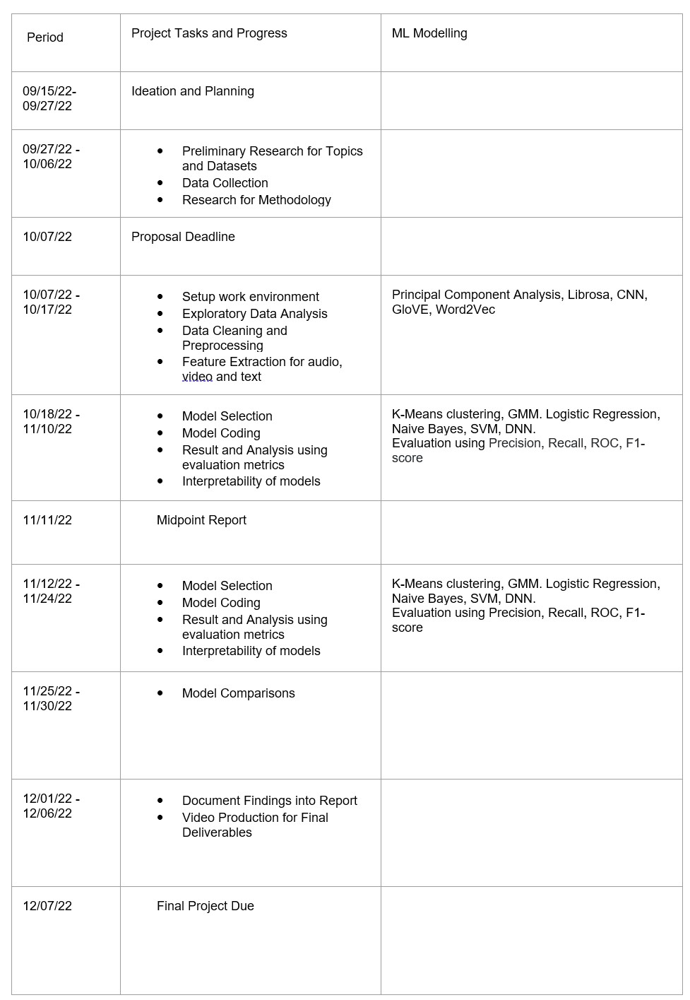

# ML 7641: Team 21

# Project Proposal
## Project Title: Multi-Modal Sarcasm Detection

### Introduction:
Sarcasm detection is a task under sentiment analysis that involves recognizing sarcastic utterances whose perlocutionary effect requires a great understanding of the conversational context, the utterance, and some basic knowledge to perceive the whole conversation. The ironic and metaphorical nature of sarcasm poses a challenge for computer models that try to analyze the sentiment of the conversation.

### Problem Definition:
Several NLP models have tried to detect sarcasm in text statements using context incongruity <a href="https://aclanthology.org/P15-2124.pdf">[1]</a> or Deep Learning NLP <a href="https://web.stanford.edu/class/archive/cs/cs224n/cs224n.1194/reports/custom/15791781.pdf">[2]</a>. Though these models have managed to achieve good accuracy by including context and embeddings of personality features <a href="https://arxiv.org/pdf/1610.08815.pdf">[3]</a>, the existing models do not focus on sarcasm detection in conversation. Past work in sarcasm detection using speech is based on identifying prosodal and spectral features that corresponds to sarcastic comments <a href="http://www1.cs.columbia.edu/~julia/papers/teppermanetal06.pdf">[4]</a>. Visual markers to understand sarcasm have been rarely studied. Thus, in our project, we aim to detect sarcasm in video segments of dialogues by extracting visual features, and combining it with the corresponding textual and audio cues to derive additional contextual information <a href="https://aclanthology.org/P14-2084">[5]</a> to identify sarcastic behavior. The motivation for sarcasm detection is to improve Conversational AI’s ability to perceive human interaction, Opinion mining, Marketing research, and Information categorization. 

### Dataset Description:
MUStARD(multimodal video corpus) <a href="https://arxiv.org/pdf/1906.01815.pdf">[6]</a> consists of audiovisual utterances annotated with sarcasm labels. Each utterance is accompanied by its context, which offers more details about the situation in which the utterance takes place. The dataset consists of 345 sarcastic videos and 6,020 non-sarcastic videos. The dataset is compiled from popular TV shows.

**Features of a Datapoint:**
- Video Sequence for Utterance
- Video Sequence for Context
- Transcripts of the Videos
- Speaker Name and Context character names
- Label (Sarcastic or not)

<!---
 
|:--:| 
| **Utterance and Context Video sequences: Text and Audio-visual components (Credit: <a href="https://arxiv.org/pdf/1906.01815.pdf">[6]</a>)** |

 
|:--:| 
| **Example of a JSON file that contains all information about the video sequences for a datapoint (Credit: <a href="https://arxiv.org/pdf/1906.01815.pdf">[6]</a>)** |
--->

<figcaption align="middle">Utterance and Context Video sequences: Text and Audio-visual components (Credit: <a href="https://arxiv.org/pdf/1906.01815.pdf">[6]</a>)</figcaption>

<figcaption align="middle">Example of a JSON file that contains all information about the video sequences for a datapoint (Credit: <a href="https://arxiv.org/pdf/1906.01815.pdf">[6]</a>)</figcaption>

### Methods:
A feature vector will be generated for each datapoint that will be a combination of its audio, video, and text.
- **Video**: CNNs like VGG, ImageNet, ResNet, etc. 
- **Audio**:  RNN models and Librosa library <a href="https://arxiv.org/pdf/1906.01815.pdf">[6]</a> (MFCC, melspectogram, spectral centroid). 
- **Text**: GloVE, ELMO, Word2Vec <a href="https://web.stanford.edu/class/archive/cs/cs224n/cs224n.1194/reports/custom/15791781.pdf">[1]</a>. 
 

The feature vectors of the 3 modalities will be combined and given as input to the supervised or unsupervised Machine Learning models. 

**Supervised methods:**
* Logistic Regression
* Naive Bayes
* Support Vector Machines
* Deep Neural Networks

**Metrics:** Precision, Recall, Accuracy, F1-Score

**Unsupervised Methods:**
* K-Mean Clustering
* Gaussian Mixture Model

**Metrics:** Silhouette Coefficient, Beta CV, pairwise measure and entropy based methods

<!---
 
|:--:| 
| **Feature Extraction and Data Analysis Flowchart** |
--->

<figcaption align="middle">Feature Extraction and Data Analysis Flowchart</figcaption>

### Potential Results and Discussion:
Our ideal goal would be to demonstrate how our multimodal approach outperforms unimodal approaches and identify the advantage of each module in providing context by experimenting with supervised and unsupervised methods. Evaluating the results of unsupervised clustering and use the observations for analyzing and cleaning the data is another task which will be addressed. Finally, will be looking to optimize and compare the different supervised classifiers using the evaluation metrics. The interpretability of the models will also be analyzed using AI Explainability tools.

### References:
<a href="https://aclanthology.org/P15-2124.pdf">[1]</a> Joshi, Aditya, Vinita Sharma, and Pushpak Bhattacharyya. "Harnessing context incongruity for sarcasm detection." Proceedings of the 53rd Annual Meeting of the Association for Computational Linguistics and the 7th International Joint Conference on Natural Language Processing (Volume 2: Short Papers). 2015.  
<a href="https://web.stanford.edu/class/archive/cs/cs224n/cs224n.1194/reports/custom/15791781.pdf">[2]</a> Lydia Xu, Vera Xu. "Project Report: Sarcasm Detection"  
<a href="https://arxiv.org/pdf/1610.08815.pdf">[3]</a> Poria, Soujanya, et al. "A deeper look into sarcastic tweets using deep convolutional neural networks." arXiv preprint arXiv:1610.08815 (2016).  
<a href="http://www1.cs.columbia.edu/~julia/papers/teppermanetal06.pdf">[4]</a> Tepperman, Joseph, David Traum, and Shrikanth Narayanan. "" Yeah right": sarcasm recognition for spoken dialogue systems." Ninth international conference on spoken language processing. 2006. 
<a href="https://aclanthology.org/P14-2084">[5]</a> Byron C. Wallace, Do Kook Choe, Laura Kertz, and Eugene Charniak. 2014. "Humans Require Context to Infer Ironic Intent (so Computers Probably do, too)". In Proceedings of the 52nd Annual Meeting of the Association for Computational Linguistics (Volume 2: Short Papers), pages 512–516, Baltimore, Maryland. Association for Computational Linguistics. 
<a href="https://arxiv.org/pdf/1906.01815.pdf">[6]</a> Castro, Santiago, et al. "Towards multimodal sarcasm detection (an _obviously_ perfect paper)." arXiv preprint arXiv:1906.01815 (2019).

### Team Member Contributions:

### Proposed Timeline:

### <a href="https://docs.google.com/spreadsheets/d/1IJ70LMrsxGJPikwkiIJkm8zs2LFqJ11leJsC7XJy1xw/edit?usp=sharing">Gantt Chart Link</a>
### <a href="https://www.canva.com/design/DAFOSFtGCEs/pXKpJgYamRmR7uMXbvFJcw/view?utm_content=DAFOSFtGCEs&utm_campaign=designshare&utm_medium=link&utm_source=viewer">Proposal Slides</a>
### <a href="https://www.youtube.com/watch?v=E7hygYxMoBk">Proposal Video - Youtube</a>

# Project MidTerm Report

## Feature Extraction
### Text
### Audio
### Video

## Exploratory Data Analysis
### Text
### Audio
### Video

## Feature Reduction/Selection
### Most Drifted Features
### PCA
### RF (not sure)

## Model Used
### Supervised
### Unsupervised

## Results and Discussion

## Future Directions
